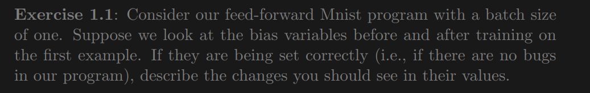
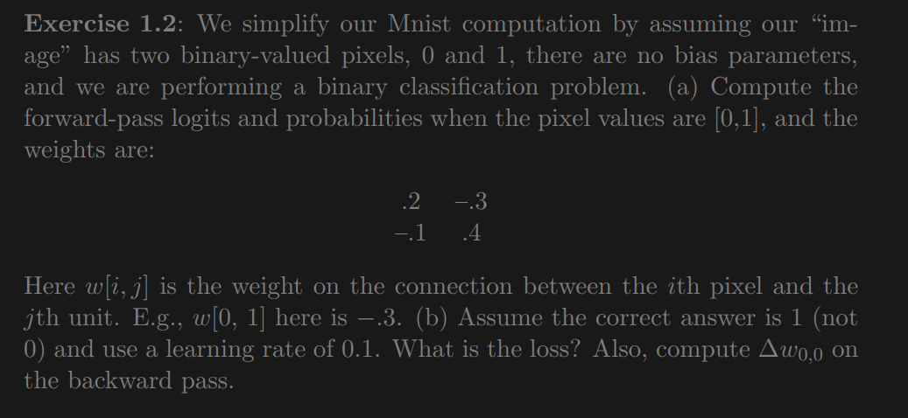
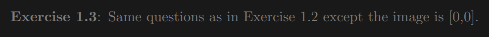
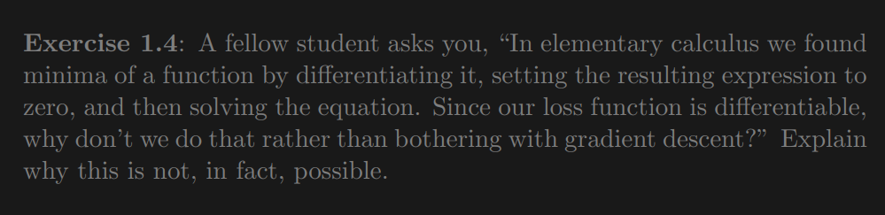
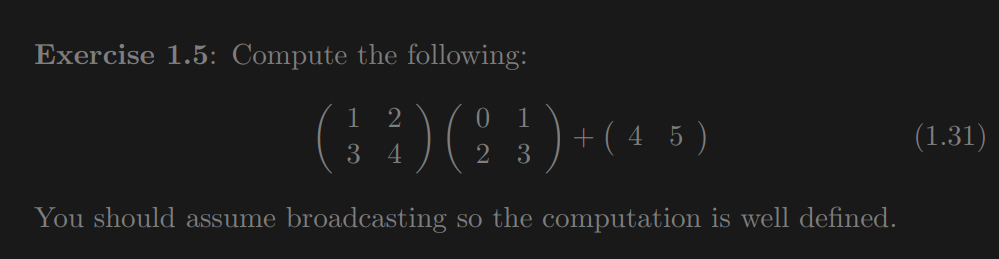
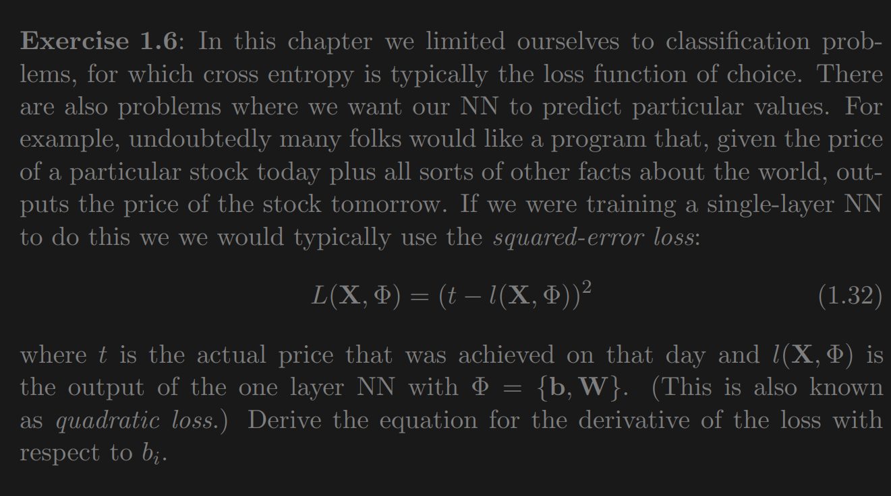

# Feed-Forward Neural Nets

The first chapter of the book is about feed-forward neural networks.

* Perceptrons
* Cross-entropy loss functions
* Matrix representation
* Data Independence

## Perceptrons

## Exercises

